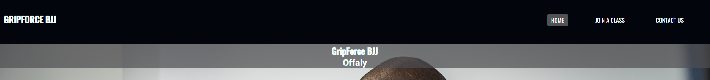
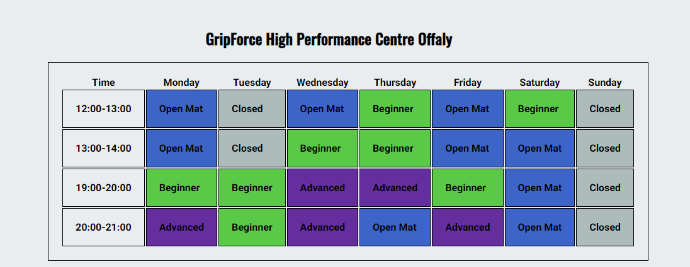
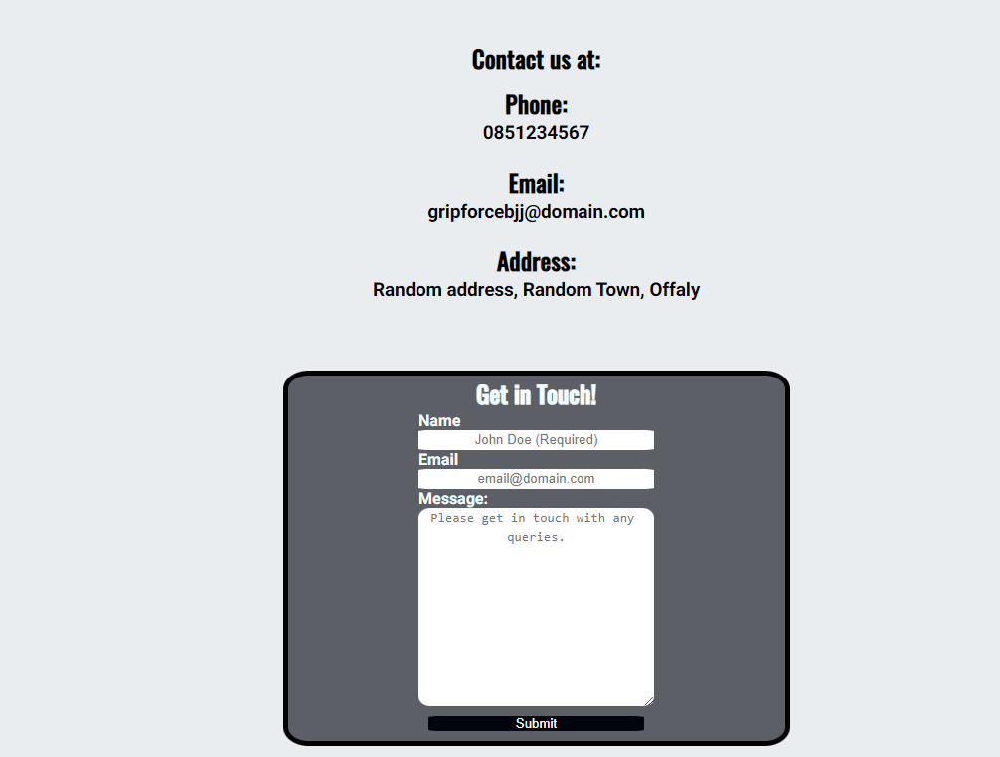
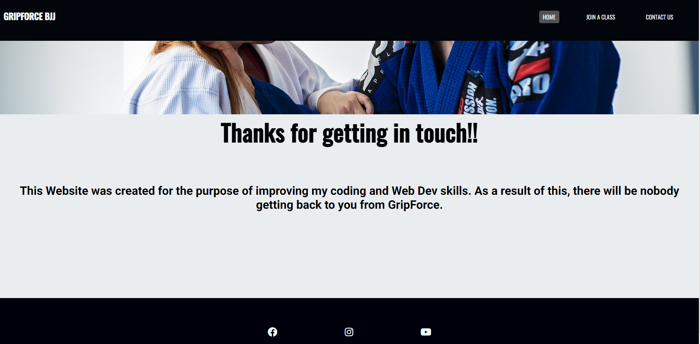
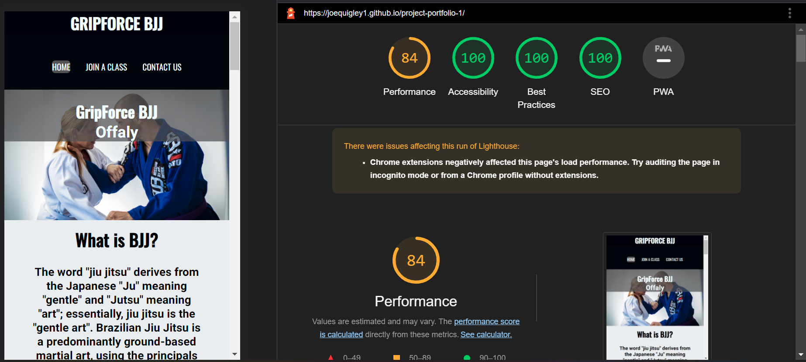

# GripForce BJJ

GripForce BJJ is the website for a fictional Brazilian Jiu Jitsu club. The site is targeted at BJJ practitioners of all levels as well as people who are totally new to the sport.

## Existing Features

* Navigation bar
   * The Navigation Bar is intended to make the users experience smooth and as easy as possible.  
   * There are three links to all of the pages of the website and a logo. It is a uniform feature across all pages of the website.
   This allows the user to navigate through the website more efficiently.
   * The Nav bar is stuck to the top of the page which allows the user to quickly go to any page on the website without the need to scroll back to the top. 

 

 * Hero Image section
    * This section is intented to immediatley give the user visual confirmation that they have visited a BJJ website.
    * It displays the name of the club and the location

 

* Explanation of what BJJ is
   * This section allows users who may have no prior knowledge of Brazilian Jiu Jitsu get abetter understanding of what the sport is. 
   * It gives a bief introduction into both the history and the concept of the Martical Art.
   * Included is a picture of two men grappling. This gives the user a clear understanding of what BJJ might look like. 

 
 

 * Benefit Block Section
    * The purpose of the benefit section is to educate users on the positive aspects of doing BJJ.
    * There are 8 reasons included. They are styled in a block container which is aimed to grab the users attention. 
    * There is a scroll feature on the blocks to accomodate different screen sizes and quantity of text.

* Footer section
   * The footer section is consistent throughout the website. 
   * It contains 3 icons of social media platforms.
   * The icons also act as links and when clicked will bring you to the website in a new tab

* Meet the coaches
  * Located on the Join us page, the Meet the coaches introduces the user to the fictional coaches of GripForce BJJ.
  * The section includes a brief bio of both coaches and their pictures. 

 

* Timetable
   * This is a fictional timetable of the time and levels of training. 
   * Each category has a unique color to allow the user to quickly absorb the information.
   * The timetable ha a scroll feature to allow smaller screens to easily view all of the information. 

   

* Contact section 
   * In this section the user can easily find all of the information about GripForce BJJ such as a phone number, address and email..
   * Also included is a form for any queries that the user would like to address.
   * The form has a name and email input and a textarea which are all required for the form to work. 

   

*  Feedback thank you page 
   * The final page is a feedback page which will open once the form is submitted.
   * It has a consistent nav and footer to maintain a seamless user experience. 

 

## Testing
  I tested the website on verious web browsers and on several different devices including different sized mobile devices.
  All of the features work as intended on all devices. 

   * Lighthouse Desktop
      * The Desktop version came back with a very positive result in the lighthouse audit. All aspects of the Website were working efficiently. 

      

   * Lighthouse Mobile
      * The mobile version for the test came back less efficient than the desktop. The accessibility measure came back with a high score however performance was much lower than the desktop version.

      
